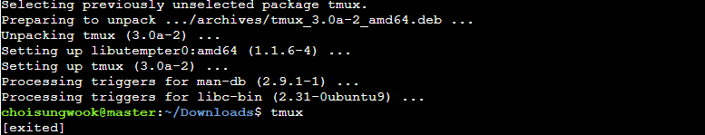

# 프로젝트 개요
1. 웹팩 공식문서를 참고하여 학습: [정리문서 링크](./documentation.md)
2. xterm.js와 웹팩을 사용하여 웹터미널 생성

# 실행 결과
* 파워쉘, sh, bash쉘 등 쉘에서 하는 모든 작업 수행


# 실행 방법
* 서버 빌드 & 실행
```sh
cd server
npm i
node ./server.js
```

* 클라이언트 빌드 & 실행
```sh
cd /
npm i
npm build run
cd dist/
웹 브라우저에서 test.html 실행
```
